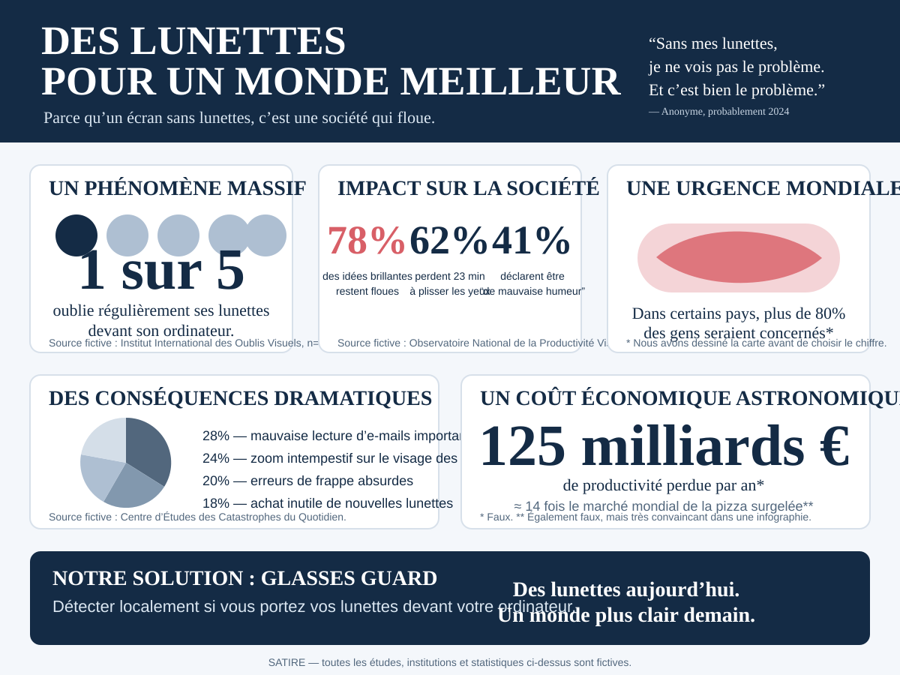

# Glasses Guard

A small, privacy-first computer-vision utility that checks whether the person currently using a computer appears to be wearing their glasses and sends a reminder when they are not.

The project is intentionally local-first: webcam frames, training images, and trained models are not meant to leave the machine.

## The societal emergency we are bravely solving



> **Satire:** every study, institution, statistic, economic estimate, and global-crisis claim in the infographic above is fictional. The software, unfortunately, is real.

## Goal

Build the smallest useful loop:

```text
webcam -> face detected? -> glasses classifier -> persistence check -> local notification
```

Glasses Guard should avoid noisy reminders. A missing-glasses prediction only becomes actionable after it remains consistent for a configurable period.

## V0 design

The initial implementation uses a classifier trained for one local setup rather than trying to solve generic eyeglass detection for everybody.

1. Capture local examples with and without glasses.
2. Detect and crop the face with OpenCV.
3. Convert the face crop to HOG features.
4. Train a small logistic-regression classifier.
5. Sample the webcam periodically.
6. Notify only when `no_glasses` remains likely for long enough.

This is deliberately simple. If it is not reliable enough, the feature extractor can later be replaced with a small neural model without changing the monitoring logic.

## Privacy and security baseline

- No cloud API is required.
- No telemetry is implemented.
- The monitor does not save webcam frames.
- Local training images live under `data/private/` and are ignored by Git.
- Trained models live under `models/private/` and are ignored by Git.
- Do not commit screenshots, webcam captures, face images, model artifacts, machine names, local paths, credentials, tokens, or environment dumps.
- Notifications contain only a generic reminder.

If this repository is public, keep all biometric or environment-specific data outside Git history.

## Requirements

- Python 3.11+
- A webcam accessible through OpenCV
- macOS, Linux, or Windows for the classifier and monitor
- Native desktop notifications are currently implemented for macOS; other platforms fall back to terminal output

## Setup

```bash
python -m venv .venv
source .venv/bin/activate
pip install -e .
```

On Windows, activate the virtual environment with the platform-appropriate command instead.

## 1. Capture training examples

Capture examples while sitting in the normal position and lighting used at the computer.

```bash
glasses-guard-capture --label glasses
glasses-guard-capture --label no_glasses
```

Press `SPACE` to save the current detected face crop and `q` to quit.

Aim for variation rather than thousands of nearly identical frames: different head angles, expressions, ambient light, and screen brightness are useful.

## 2. Train the local classifier

```bash
glasses-guard-train
```

The model is written to `models/private/glasses_classifier.joblib` and is intentionally ignored by Git.

The reported validation score is only a sanity check. Consecutive webcam captures are highly correlated, so real-world behavior matters more than a single accuracy number.

## 3. Run the monitor

```bash
glasses-guard-monitor
```

Useful options:

```bash
glasses-guard-monitor --sample-interval 5 --alert-after 30 --cooldown 900
```

Defaults:

- sample every 5 seconds;
- require 30 seconds of persistent `no_glasses` predictions;
- wait 15 minutes before repeating an alert.

No alert is generated while no face is detected.

## Current limitations

- V0 is personalized to one camera/setup and is not a general-purpose glasses detector.
- Back-to-back captured images can make validation results look better than real usage.
- Reflections, sunglasses, very thin frames, lighting changes, or large pose changes may reduce accuracy.
- Notifications are native only on macOS for now.

## Possible next steps

Only add complexity when V0 measurements justify it:

- confidence calibration and an explicit `uncertain` state;
- better temporal smoothing;
- automatic launch at login;
- menu-bar/tray status;
- platform-native notifications for Linux and Windows;
- a lightweight learned image embedding if HOG is insufficient.

The project should remain disposable and easy to understand: reliability before architecture.
